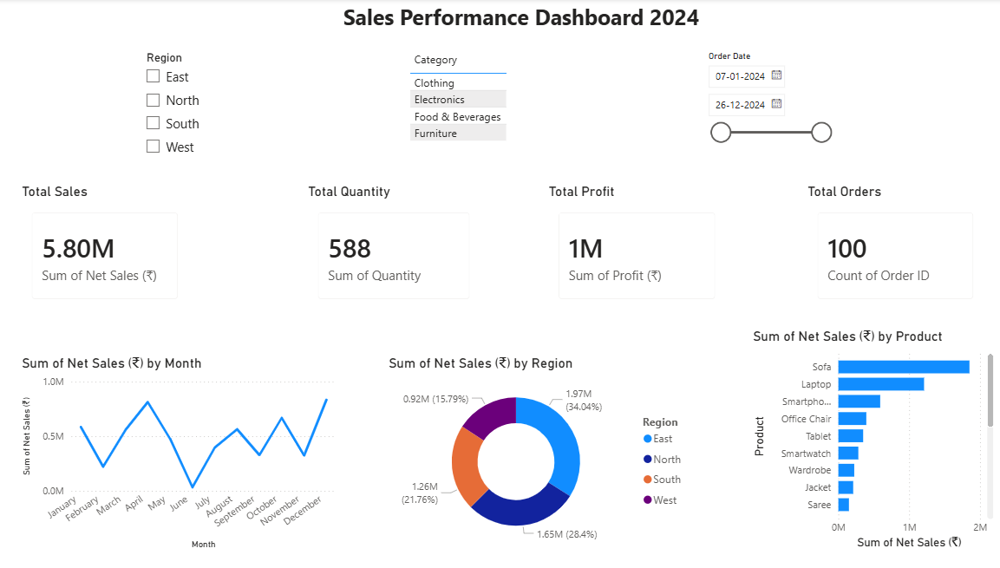

# 📊 Sales Performance Dashboard 2024

An interactive Sales Performance Dashboard built using **Microsoft Power BI**, analyzing sales data across regions, categories, and products for the year 2024.

---

## 📌 Project Overview

This project visualizes key business metrics from a sales dataset to help understand performance trends, regional breakdowns, and top-performing products throughout 2024.

---

## 📈 Key Metrics

| Metric | Value |
|---|---|
| 💰 Total Sales | ₹5.80M |
| 📦 Total Quantity Sold | 588 |
| 🏆 Total Profit | ₹1M |
| 🧾 Total Orders | 100 |

---

## 🗂️ Features

- **Monthly Sales Trend** – Line chart showing Net Sales (₹) across all 12 months
- **Regional Sales Breakdown** – Donut chart comparing sales across East, North, South, and West regions
- **Top Products by Sales** – Horizontal bar chart ranking products by Net Sales
- **Interactive Filters** – Filter by Region, Category, and Order Date range

---

## 🌍 Regional Sales Summary

| Region | Sales (₹) | Share |
|---|---|---|
| East | 1.97M | 34.04% |
| South | 1.65M | 28.40% |
| North | 1.26M | 21.76% |
| West | 0.92M | 15.79% |

---

## 🛍️ Product Categories

- Clothing
- Electronics
- Food & Beverages
- Furniture

---

## 🛠️ Tools Used

- **Microsoft Power BI** – Dashboard creation and data visualization
- **Microsoft Excel** – Data preparation and cleaning

---

## 📂 Files in This Repository

| File | Description |
|---|---|
| `Sales_Dashboard.pbix` | Power BI dashboard file |
| `Sales_dashboard.png` | Dashboard screenshot preview |
| `Sales_Data.xlsx` | Raw sales dataset |
| `README.md` | Project documentation |

---

## 🖼️ Dashboard Preview

---

## 👩‍💻 Author

**Hisana Jannath P.K**
